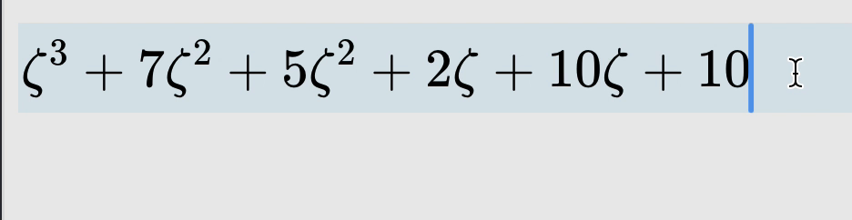

# Euler Engine

A computer algebra system written in Rust. This library is used as a core computational engine for [EulerNote](https://eulernote.com) (experimental project).



<br/>

# Example

```rust
use euler_engine::{Num, Sym};

fn main() {
let x = Sym::new("x");
let y = Sym::new("y");
let n2 = Num::new(2);
assert_eq!(
    (x + (y ^ n2) + n2 * (y ^ n2)).collect().to_string(),
    "x+3*y^{2}"
    );
}
```

With Latex input and output

```rust
use euler_engine::{collect};

fn main() {
    assert_eq!(collect("x+y^{2}+2y^{2}".to_string()), "x +3y ^{2}");
}

```
